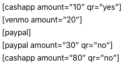
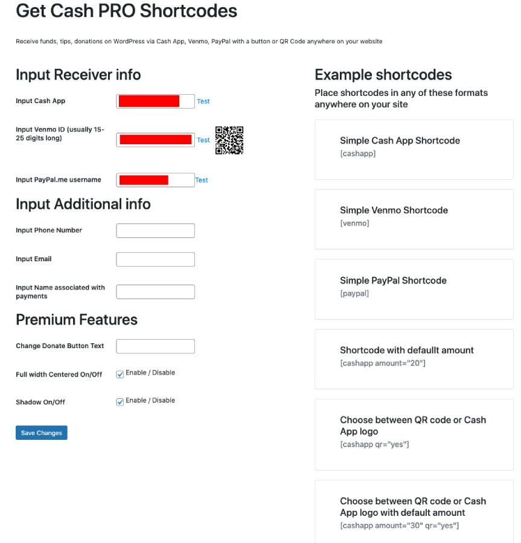

  

  <h3 align="center">Get Cash on WordPress</h3>

  

    Receive funds, tips, donations on WordPress via Cash App, Venmo, PayPal with a button or QR Code anywhere on your WordPress website
     
    <a href="https://theafricanboss.com/get-cash"><strong>Learn More »</strong></a>
     
     
    <a href="https://theafricanboss.com/get-cash">View Demo</a>
    ·
    <a href="https://github.com/theafricanboss/get-cash/issues">Report Bug</a>
    ·
    <a href="https://github.com/theafricanboss/get-cash/issues">Request Feature</a>
  

## PRO or customized version

Please reach out to theafricanboss@gmail.com for a custom version of this plugin.

Visit [The African Boss](https://theafricanboss.com/get-cash) for more details

## Demo

Here is [a demo for this plugin](https://theafricanboss.com/get-cash) 

This plugin displays a buton or QR code that sends users to your Cash App, Venmo, Paypal, etc.

See the screenshots for visual details.

## Screenshots

See screenshots below for visual details.

## Installation

### From Dashboard ( WordPress admin )

- Go to Plugins -> Add New
- Search for ‘Get Cash’
- Click on Install Now
- Activate the plugin through the “Plugins” menu in WordPress.

### Using cPanel or FTP

- Download ‘Get Cash’ from [The African Boss](https://theafricanboss.com/get-cash)
- Unzip get-cash.zip’ file and
- Upload get-cash folder to the “/wp-content/plugins/” directory.
- Activate the plugin through the “Plugins” menu in WordPress.

### After Plugin Activation

Find and click Get Cash in your admin dashboard left sidebar to access Get Cash settings

Also _you can visit_ the [plugin page](https://theafricanboss.com/get-cash) for further setup instructions.

## Frequently Asked Questions

### What apps or payments do you currently support?

Get Cash plugin currently supports Cash App, Venmo, and PayPal